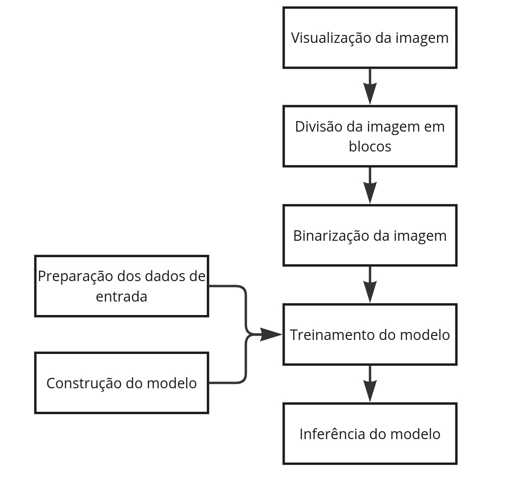

# Desafio_IA

Projeto de modelo de rede neural artificial para segmentar imagens para detecções de vegetações.

## Introdução

Este projeto visa segmentar áreas de plantação em imagens naseado em uma rede neural U-Net. O processo envolve a divisão da imagem TIFF em blocos (frames) menores, binarização das imagens para destacar áreas de vegetação utilizando o índice ExG (Excess Green Index), e treinamento do modelo para segmentar as áreas de plantação. O modelo treinado foi testado em novas imagens coletadas na internet para verificar sua capacidade de generalização.

## Fluxograma

## Utilização 

Certificar que tem os pacotes e versões do requirements.txt

**display_image.py**
python display_image.py --image_path <caminho_imagem_tiff>

**divide_orthomosaic.py**
python divide_orthomosaic.py --input <caminho_imagem_tiff> --output <diretório_saida>

**binarize_images.py**
python binarize_images.py --input <diretório_imagens_rgb> --output <diretório_saida>

**train_model.py**
python train_model.py --rgb <diretório_imagens_rgb> --groundtruth <diretório_imagens_segmentadas> --modelpath <caminho_salvar_modelo>

**inference_model**
python inference_model.py --rgb <diretório_imagens_teste> --modelpath <caminho_modelo> --output <diretório_saida>

## Referências

Computing Excess Green Vegetation Index (ExG) in QGIS. Disponível em: https://gis.stackexchange.com/questions/383815/computing-excess-green-vegetation-index-exg-in-qgis

RIBEIRO, João Batista. Detecção de linhas de plantio em plantações de cana-de-açucar utilizando deep-learning. Universidade Federal de Uberlândia, 2023. Disponível em: https://repositorio.ufu.br/bitstream/123456789/39346/1/Deteccao_linhas_plantio.pdf

Segmentação de Imagens. Disponível em: https://www.tensorflow.org/tutorials/images/segmentation?hl=pt-br

The U-Net : A Complete Guide: Disponível em: https://medium.com/@alejandro.itoaramendia/decoding-the-u-net-a-complete-guide-810b1c6d56d8

U-Net Architecture Explained. Disponível em: https://www.geeksforgeeks.org/u-net-architecture-explained/

